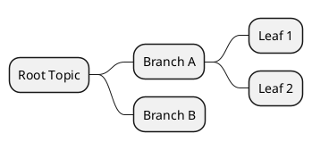

# Arc42 PlantUML Diagram Generator

Create, improve, and validate PlantUML diagrams for arc42 chapters.

## Diagram types by chapter

| Chapter | Diagram type | PlantUML keyword |
|---------|-------------|------------------|
| 3 - Context | System context | `rectangle`, `actor` |
| 5 - Building blocks | Component/package | `package`, `rectangle`, `database` |
| 6 - Runtime | Sequence diagrams | `participant`, `->` |
| 6 - Runtime | Activity diagrams | `start`, `if`, swim lanes |
| 7 - Deployment | Deployment nodes | `node`, `artifact`, `database`, `cloud` |
| 10 - Quality | Mind maps | `@startmindmap` |

## Style guide (always apply)

```plantuml
skinparam shadowing false
skinparam componentStyle rectangle
```

### Colors

| Element | Color |
|---------|-------|
| Your system (boundary) | `#LightBlue` |
| Highlighted system | `#OrangeRed` |
| Infrastructure | `#lightgreen` |
| External systems | `#lightblue` |
| White-box internals | `#white` |

### Sequence diagrams

```plantuml
hide footbox
skinparam shadowing false
participant "Name" as Alias
Alias -> Other ++ : message
Other --> Alias -- : response
```

- Use `++`/`--` for activation bars
- Use `== Section ==` for logical groupings
- Max 7 participants per diagram

### Activity diagrams

```plantuml
|Swim Lane Name|
start
:Action;
if (Condition?) then (yes)
  :Happy path;
else (no)
  :Alternative;
endif
stop
```

### Deployment diagrams

```plantuml
node "Physical Host" #lightgreen {
  node "Runtime" #white {
    artifact "Service\n(container)" as Svc
  }
  database "DB" as DB
}
cloud "External" #lightblue {
  node "API" as ExtApi
}
Svc --> DB : SQL
Svc --> ExtApi : REST
```

### Mind maps



## Quality rules

- Max 7-10 elements per diagram. Split into sub-diagrams if larger.
- Every arrow must have a label (protocol, data type, or action).
- Use `\n` in labels for multi-line text on connections.
- Always validate PlantUML syntax before outputting.
- Match component names to actual codebase names.
