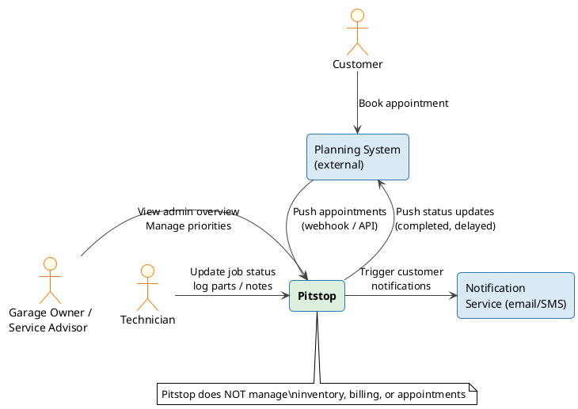
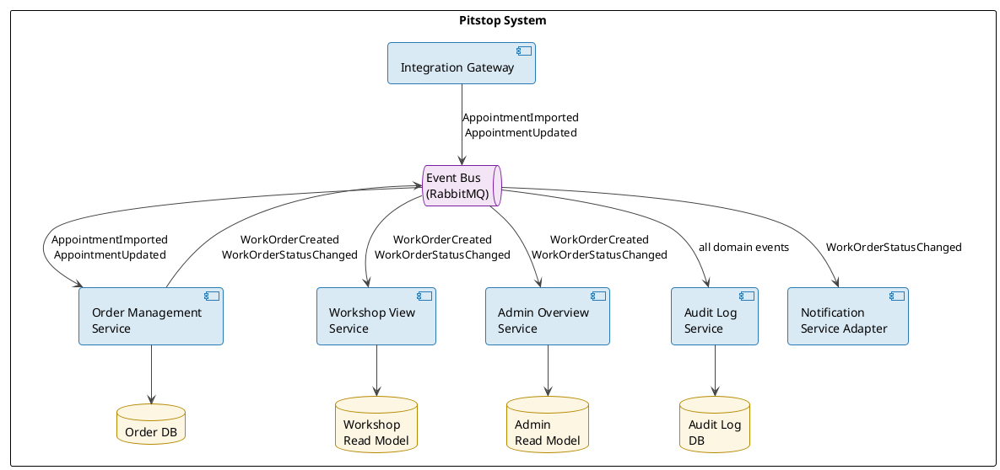
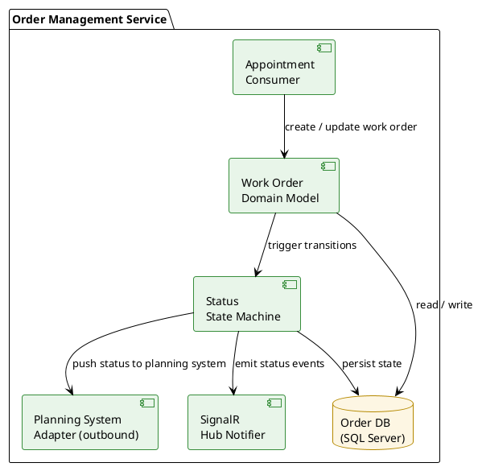
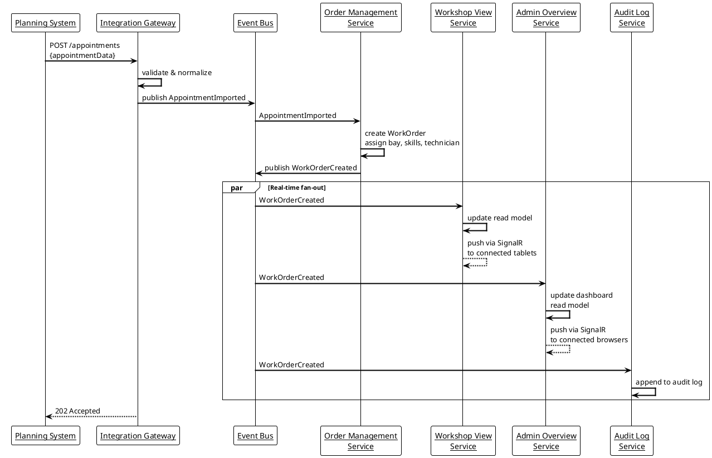
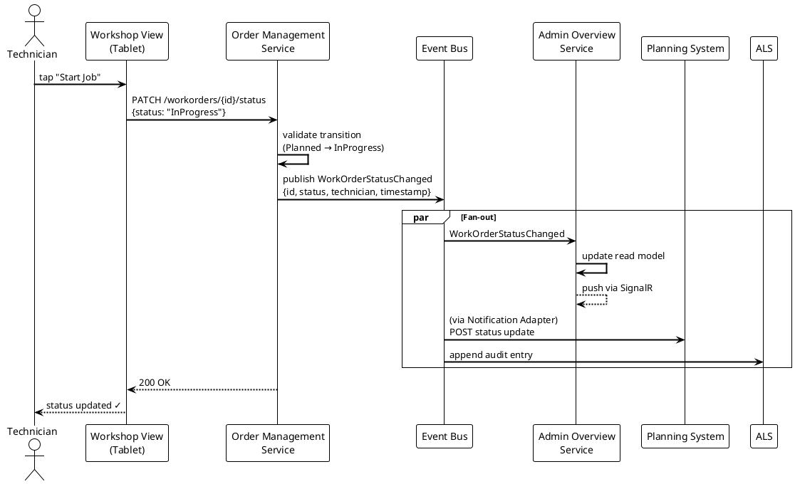
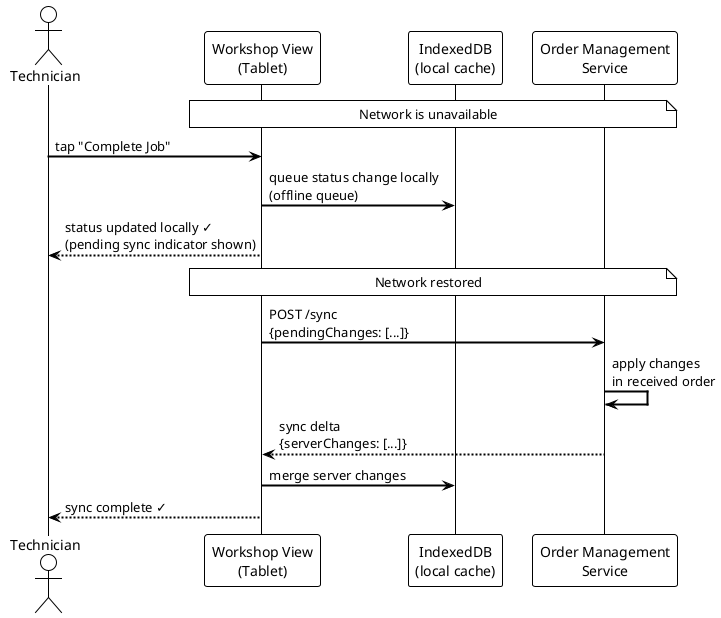
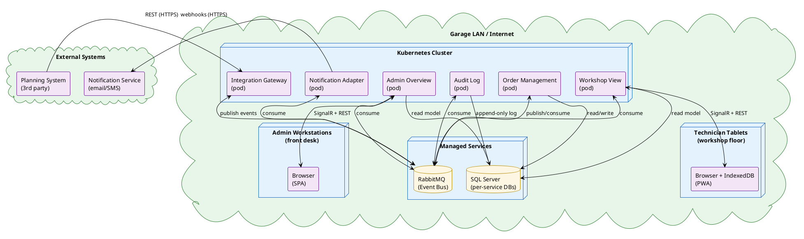

# Pitstop — arc42 Architecture Documentation Example

> **This is a worked example** of the arc42 template for the fictitious _Pitstop_ garage workshop management system.
> It demonstrates how each chapter looks when filled in, including **PlantUML diagrams** for visual architecture views.
>
> Based on Michaël Hompus's [Arc42 Practical Series](https://blog.hompus.nl/2026/02/01/arc42-practical-series/)
> and the [original Pitstop arc42 example](https://gist.github.com/eNeRGy164/90f63e78d3e528f7b8490538a6781b5f) by [@eNeRGy164](https://github.com/eNeRGy164).

---

## Table of Contents

1. [Introduction and Goals](#1-introduction-and-goals)
2. [Architecture Constraints](#2-architecture-constraints)
3. [System Scope and Context](#3-system-scope-and-context)
4. [Solution Strategy](#4-solution-strategy)
5. [Building Block View](#5-building-block-view)
6. [Runtime View](#6-runtime-view)
7. [Deployment View](#7-deployment-view)
8. [Cross-Cutting Concepts](#8-cross-cutting-concepts)
9. [Architectural Decisions](#9-architectural-decisions)
10. [Quality Requirements](#10-quality-requirements)
11. [Technical Risks and Debts](#11-technical-risks-and-debts)
12. [Glossary](#12-glossary)

---

## 1. Introduction and Goals

Pitstop is the operational backbone of an independent car repair garage. The garage uses an external planning tool to schedule customer appointments, but that tool has no insight into what actually happens inside the workshop. Technicians were updating paper boards, advisors were calling in to check on job status, and customers were getting inaccurate ETAs — all because the planning system and the workshop floor were disconnected.

Pitstop bridges this gap: it imports appointments from the planning system, converts them into actionable work orders, and keeps both the admin overview and the workshop view synchronized in near real-time. Technicians interact with Pitstop from the workshop floor; advisors use it to give customers accurate status updates.

### 1.1 Requirements Overview

**The most important requirements:**

- Import appointments from one or more external planning services.
- Convert appointments into work orders with assigned technicians, bay numbers, and required skills.
- Provide a **workshop view** for technicians: task list per bay, one-tap status updates.
- Provide an **admin overview** for service advisors: full workload, delays, priorities.
- Push work order status changes back to the planning system in near real-time.
- Operate in **offline mode** when workshop connectivity is unreliable; sync on reconnect.
- Log every state change immutably for auditability.

**Explicit non-goals:**

- Pitstop does NOT create or edit appointments in the planning system.
- Pitstop does NOT manage parts inventory or stock levels.
- Pitstop does NOT handle customer invoicing or billing.
- Pitstop does NOT replace the planning system.

### 1.2 Quality Goals

| Priority | Quality Goal    | Scenario                                              | Acceptance Criteria                                     |
| -------: | :-------------- | :---------------------------------------------------- | :------------------------------------------------------ |
| 1        | Consistency     | A technician updates a job status on the workshop floor | Admin overview reflects the change within 2 seconds   |
| 2        | Availability    | Workshop Wi-Fi drops during peak hours                | Workshop view continues to function for at least 30 minutes; syncs automatically on reconnect |
| 3        | Modifiability   | Garage switches to a new planning software            | A new planning integration can be added in < 2 days with no changes to core logic |
| 4        | Auditability    | A dispute arises about who closed a work order early  | Every state change includes timestamp, user, and reason; retrievable in < 1 minute |
| 5        | Usability       | Technician updates job status while wearing gloves    | Any critical status update requires at most 2 taps on a 7" tablet |

### 1.3 Stakeholders

| Stakeholder            | Role / Interest                                      | Key Expectations                                               |
| :--------------------- | :--------------------------------------------------- | :------------------------------------------------------------- |
| Garage Owner           | Business success, throughput, customer satisfaction  | Full visibility into workshop capacity and job completion rate |
| Service Advisor        | Front-desk; makes promises to customers              | Real-time job status, accurate ETAs, early warning of delays  |
| Technician             | Does the actual repair work                          | Fast, glove-friendly interface; no manual admin overhead       |
| Planning System        | External; schedules customer appointments            | Receives timely, accurate status updates from Pitstop          |
| Customer               | Drops off vehicle for repair                         | Accurate pick-up time, transparency on delays                  |
| Operations / IT        | Runs and maintains the system                        | Easy deployment, observable system, minimal manual operations  |

---

## 2. Architecture Constraints

### 2.1 Technical Constraints

| Constraint                                          | Reason / Background                                                        |
| :-------------------------------------------------- | :------------------------------------------------------------------------- |
| Must run on .NET 8 LTS                              | Company-wide standard; aligns with Microsoft LTS support lifecycle         |
| Must containerize all services (Docker)             | IT standardized on container-based deployments for all new applications    |
| Must support offline-first operation for workshop UI | Workshop Wi-Fi is unreliable; data loss is unacceptable during outages   |
| Message broker must be RabbitMQ                     | Existing RabbitMQ infrastructure is available; team has operational expertise |
| Database per service (no shared DB)                 | Required by microservices mandate to ensure independent deployability      |

### 2.2 Organizational Constraints

| Constraint                                          | Reason / Background                                                        |
| :-------------------------------------------------- | :------------------------------------------------------------------------- |
| Team of 3 developers + 1 UX designer               | Budget constraint; architecture must avoid operational complexity          |
| No 24/7 on-call rotation                            | Team supports only during business hours; system must be self-healing      |

### 2.3 Conventions and Standards

| Constraint                                          | Reason / Background                                                        |
| :-------------------------------------------------- | :------------------------------------------------------------------------- |
| All APIs must expose OpenAPI 3.0 specs              | Company API governance; required for API gateway integration               |
| Semantic versioning for all service contracts        | Prevents breaking consumers when interfaces change                        |
| All ADRs recorded in arc42 Chapter 9               | Team decision; ADRs must travel with the code in the repository            |

---

## 3. System Scope and Context

Pitstop sits between the **external planning system** (which owns appointments) and the **workshop floor** (where the actual work happens). It is responsible for the translation, state management, and synchronization between these two worlds.

### 3.1 Business Context



| External System / Actor     | Description                                          | Direction          |
| :--------------------------- | :--------------------------------------------------- | :----------------- |
| Planning System              | External scheduling tool; owns appointments          | In (appointments), Out (status updates) |
| Service Advisor              | Front-desk staff using admin overview                | In (actions)       |
| Technician                   | Workshop staff using workshop view on tablet         | In (status updates) |
| Customer                     | Indirect; books through planning system              | Out (notifications via Notify Service) |
| Notification Service         | Email/SMS gateway; sends customer updates            | Out (events)       |

### 3.2 Technical Context

| External System / Interface  | Communication Protocol         | Data Exchanged                                   |
| :--------------------------- | :----------------------------- | :----------------------------------------------- |
| Planning System (inbound)    | Webhook / REST over HTTPS      | Appointment created/updated/cancelled (JSON)     |
| Planning System (outbound)   | REST over HTTPS                | Work order status updates (JSON)                 |
| Notification Service         | REST over HTTPS                | Notification trigger events (JSON)               |
| Technician tablets           | SignalR (WebSocket) + HTTP     | Real-time work order updates; offline sync delta |
| Admin overview browser       | HTTP + SignalR                 | Dashboard data; real-time push events            |

---

## 4. Solution Strategy

Pitstop's core challenge is bridging two separate worlds (planning and workshop) with high reliability, even under poor network conditions. The following strategies address the quality goals and constraints:

| Strategy              | Decision / Approach                                                            | Rationale                                                                       |
| :-------------------- | :----------------------------------------------------------------------------- | :------------------------------------------------------------------------------ |
| Architecture style    | Event-driven microservices with a shared event bus (RabbitMQ)                  | Decouples services so each can be deployed, scaled, and changed independently; satisfies the Modifiability goal |
| Offline capability    | CQRS + local IndexedDB cache in the Workshop View; delta sync on reconnect     | Workshop must function without a network connection (Availability goal)         |
| Real-time updates     | SignalR push from Order Management to all connected clients                    | Ensures admin and workshop views converge within 2 seconds (Consistency goal)  |
| Auditability          | Append-only event log via Audit Log Service; sourced from all domain events    | Every state change is captured as an immutable event (Auditability goal)       |
| Planning integration  | Plugin-based Integration Gateway with one adapter per planning system          | Swapping or adding planning tools requires only a new adapter (Modifiability)  |
| Deployment            | Docker containers orchestrated by Kubernetes; one container per service        | Meets the IT containerization constraint; enables independent service scaling  |

---

## 5. Building Block View

### 5.1 Level 1 — Top-Level Decomposition

Pitstop is composed of six services communicating via a shared event bus. The Integration Gateway and Order Management are the central services; the others consume events and maintain their own read models.



| Building Block             | Responsibility                                                                       | Key Interfaces                                       |
| :------------------------- | :----------------------------------------------------------------------------------- | :--------------------------------------------------- |
| Integration Gateway        | Receives appointments from external planning systems; normalizes and publishes events | REST inbound (webhooks), Event Bus outbound          |
| Order Management Service   | Converts appointments to work orders; manages full work order lifecycle              | REST API (read/write), Event Bus (publish/subscribe) |
| Workshop View Service      | Serves the technician tablet UI; manages offline sync and real-time updates          | SignalR (real-time), REST API, IndexedDB (client)    |
| Admin Overview Service     | Serves the admin/advisor dashboard with live workload and priority data              | REST API, SignalR (real-time push)                   |
| Audit Log Service          | Consumes all domain events; stores immutable audit trail                             | Event Bus (subscribe only), REST API (query)         |
| Notification Service Adapter | Translates domain events to customer notifications; calls external Notify service  | Event Bus (subscribe), REST outbound (notify API)    |

### 5.2 Level 2 — Order Management Service internals

Order Management is the most complex service and contains the core business logic.



---

## 6. Runtime View

### Scenario 1: Appointment imported → Work order created

A new appointment arrives from the external planning system via webhook. Pitstop processes it, creates a work order, and pushes the update to all connected clients.



### Scenario 2: Technician updates job status (online)

A technician marks a job as "In Progress" from the workshop tablet. The change propagates to all views within 2 seconds.



### Scenario 3: Technician works offline (offline mode)

Workshop Wi-Fi drops. The technician continues working with locally cached data. When connectivity returns, changes sync automatically.



---

## 7. Deployment View

### 7.1 Infrastructure Overview

Pitstop runs on a managed Kubernetes cluster. Each service is an independent container. RabbitMQ and SQL Server are managed services provided by the hosting environment.



### 7.2 Environment Mapping

| Environment    | Purpose                          | Notable Differences from Production                                      |
| :------------- | :------------------------------- | :----------------------------------------------------------------------- |
| Production     | Live garage operations           | Full scale; real planning system; managed SQL Server + RabbitMQ         |
| Staging        | Pre-release validation           | Reduced replica count; planning system in sandbox mode; anonymized data  |
| Development    | Developer testing                | Docker Compose (local); stub planning system; single-node SQL + RabbitMQ |

---

## 8. Cross-Cutting Concepts

### 8.1 Event-Driven Communication

All service-to-service communication uses domain events published to RabbitMQ. Services never call each other directly. Each service owns its own read model, updated by subscribing to the relevant events.

_Rationale:_ Decouples services, prevents cascading failures, and makes adding a new consumer (e.g., a reporting service) a zero-impact change.

### 8.2 Offline Sync (Workshop View)

The Workshop View is a Progressive Web App (PWA) with an IndexedDB local cache. Any write operation while offline is queued locally with a monotonic timestamp. On reconnect, the client sends its pending queue to the Order Management Service, which applies changes idempotently and returns the delta of server-side changes.

_Rationale:_ The workshop floor has unreliable Wi-Fi. Technicians cannot stop working when the network drops.

### 8.3 Audit Logging

Every domain event published to the event bus is consumed by the Audit Log Service and written to an append-only table. Records include: event type, aggregate ID, user ID, timestamp, and the full event payload (JSON). Records are never updated or deleted.

_Rationale:_ Required for dispute resolution and accountability. Enables replaying history for debugging.

### 8.4 Authentication and Authorization

All HTTP endpoints require a JWT bearer token issued by the garage's identity provider (OAuth 2.0 / OIDC). Role claims in the token control access:
- `technician`: can read and update workshop view
- `advisor`: can read admin overview and override priorities
- `admin`: full access including audit log queries

### 8.5 Error Handling and Resilience

- Services use the **Retry pattern** with exponential backoff for all outbound HTTP calls.
- **Dead-letter queues** in RabbitMQ capture failed message processing; an alert fires after 3 failed attempts.
- The Integration Gateway returns `202 Accepted` immediately; all processing happens asynchronously to avoid blocking the planning system.

### 8.6 API Design

All APIs are RESTful with OpenAPI 3.0 specifications. APIs use semantic versioning in the URL path (`/v1/...`). Breaking changes require a new version; old versions are maintained for 6 months.

---

## 9. Architectural Decisions

| Date       | Decision                                             | Status   | Rationale / Alternatives Considered                                |
| :--------- | :--------------------------------------------------- | :------- | :----------------------------------------------------------------- |
| 2024-03-15 | Event-driven microservices with RabbitMQ             | Accepted | Satisfies Modifiability and Availability goals; RabbitMQ is existing infrastructure. _Alternative: REST-only monolith — rejected, tight coupling makes new integrations risky._ |
| 2024-03-15 | CQRS with per-service read models                    | Accepted | Allows Workshop View and Admin Overview to be optimized independently. _Alternative: Shared DB — rejected, creates deployment coupling and violates microservices constraint._ |
| 2024-04-02 | PWA with IndexedDB for offline workshop support      | Accepted | Only viable approach for offline-first on tablets without native app. _Alternative: Native mobile app — rejected, too costly to maintain across platforms._ |
| 2024-05-10 | Append-only audit log (no updates/deletes)           | Accepted | Guarantees immutability; simple to reason about. _Alternative: Event Sourcing for all services — rejected, too complex for current team size._ |
| 2024-06-01 | Plugin-based adapter pattern for planning integration | Accepted | Satisfies the < 2-day integration change goal. _Alternative: Hard-coded integration per system — rejected, makes adding a second planning tool a major project._ |

### ADR-001: Event-Driven Microservices with RabbitMQ

**Date:** 2024-03-15
**Status:** Accepted

**Context:**
Pitstop must connect several independent services (planning import, order management, workshop view, admin overview, audit). These services have different update frequencies and availability requirements. The integration must be extensible (add a new planning system without changing existing code).

**Decision:**
All inter-service communication uses asynchronous domain events published to a RabbitMQ topic exchange. Services communicate only via the event bus — no direct service-to-service HTTP calls.

**Rationale:**
- Decouples services; one service going down does not affect others.
- Adding a new consumer (e.g., reporting, new planning integration) requires zero changes to existing services.
- RabbitMQ infrastructure already exists; team has operational expertise.

**Alternatives Considered:**
- **REST-only inter-service calls:** Simple but creates tight coupling; a slow Order Management would make all clients slow.
- **gRPC:** Better performance but no offline buffering; overkill for event volumes involved.

**Consequences:**
- Eventual consistency: clients may see stale data for up to 2 seconds (acceptable per quality goal).
- Requires dead-letter queue monitoring and alerting.
- Developers must think in terms of events, not request/response.

---

## 10. Quality Requirements

### Quality Tree

```
Quality Goals
├── Consistency (P1)
│   └── All connected UIs reflect any state change within 2 seconds
├── Availability (P2)
│   └── Workshop view continues to function during network outage
│       └── Syncs correctly and idempotently when connectivity returns
├── Modifiability (P3)
│   └── Adding a new planning system integration does not touch core logic
├── Auditability (P4)
│   └── Every work order state change can be traced to a user and timestamp
└── Usability (P5)
    └── Technicians can update job status efficiently under real workshop conditions
```

### Quality Scenarios

| Quality Goal    | Stimulus                                                   | System Response                                                      | Acceptance Criterion                                                        |
| :-------------- | :--------------------------------------------------------- | :------------------------------------------------------------------- | :-------------------------------------------------------------------------- |
| Consistency     | Technician marks job "In Progress" on tablet               | Order Management publishes event; Admin Overview push notification sent | Admin overview reflects change within **2 seconds** (P95)                 |
| Availability    | Workshop Wi-Fi drops for 45 minutes during morning peak    | Workshop View falls back to IndexedDB cache; offline queue accumulates | Zero data loss; status updates queued and synced on reconnect within 5s   |
| Modifiability   | New planning software vendor requires a new integration    | Team develops new Integration Gateway adapter                         | Adapter complete and tested in **< 2 working days**; no changes to OMS, WVS, or AOS |
| Auditability    | Service advisor disputes who closed a work order           | Admin queries audit log via REST API                                  | Full event history (who, when, what) returned in **< 1 second**           |
| Usability       | Technician updates job status wearing nitrile gloves       | Taps "Complete" button on 7" Android tablet                           | Task accomplished in **≤ 2 taps**, touch targets ≥ 48×48dp                 |

---

## 11. Technical Risks and Debts

### 11.1 Known Risks

| Risk                                                   | Probability | Impact | Mitigation Strategy                                                |
| :----------------------------------------------------- | :---------- | :----- | :----------------------------------------------------------------- |
| RabbitMQ is a single point of failure                  | Medium      | High   | Enable RabbitMQ clustering; configure quorum queues for durability |
| Offline sync conflict resolution is complex            | High        | Medium | Use last-write-wins with server timestamp; add conflict detection in V2 |
| Planning system API changes without notice             | Medium      | High   | Pin Integration Gateway to a versioned API; add contract tests against planning system sandbox |
| Large tablet battery drain from continuous SignalR     | Low         | Medium | Implement adaptive polling fallback when battery < 20%            |

### 11.2 Technical Debt

| Area                       | Description                                                            | Consequence if Ignored                                          | Priority |
| :------------------------- | :--------------------------------------------------------------------- | :-------------------------------------------------------------- | :------- |
| Integration Gateway        | Currently only supports one planning system (hard-coded adapter config) | Adding second planning system requires refactoring             | High     |
| Workshop View offline sync | Conflict resolution is "last write wins" — no user notification       | Data loss if two technicians update the same job offline simultaneously | Medium |
| Audit Log Service          | No data retention policy or archiving implemented yet                  | Audit table grows unbounded; query performance degrades over time | Medium  |
| Test coverage              | Integration tests only cover the happy path for appointment import     | Regression risk for edge cases (duplicate events, null fields)  | High     |

---

## 12. Glossary

| Term                    | Definition                                                                                          |
| :---------------------- | :-------------------------------------------------------------------------------------------------- |
| Appointment             | A scheduled service event for a customer vehicle, created in the external planning system           |
| Work Order              | Pitstop's internal representation of an appointment; includes bay assignment, technician, tasks     |
| Bay                     | A physical workspace in the garage where a vehicle is serviced                                      |
| Integration Gateway     | The Pitstop service responsible for receiving and normalizing appointments from planning systems     |
| Order Management Service (OMS) | Core service owning the work order lifecycle and state machine                             |
| Workshop View           | The technician-facing Progressive Web App (PWA) displayed on workshop tablets                       |
| Admin Overview          | The service advisor / manager-facing dashboard showing workload, priorities, and real-time status   |
| Audit Log               | An append-only record of every domain event, used for traceability and dispute resolution           |
| Event Bus               | The RabbitMQ message broker through which all inter-service communication flows                     |
| Domain Event            | An immutable fact that something happened (e.g., `WorkOrderCreated`, `WorkOrderStatusChanged`)      |
| CQRS                    | Command Query Responsibility Segregation — separates read models from write models per service      |
| PWA                     | Progressive Web App — a web application with offline capability via service workers and IndexedDB   |
| IndexedDB               | Browser-native local database used by the Workshop View for offline caching                         |
| Dead-Letter Queue (DLQ) | A RabbitMQ queue that receives messages that could not be processed after the maximum retry attempts |
| Planning System         | The external appointment scheduling tool that Pitstop integrates with (e.g., a garage management SaaS) |

---

*This example is based on the fictitious Pitstop garage system from Michaël Hompus's [Arc42 Practical Series](https://blog.hompus.nl/2026/02/01/arc42-practical-series/) and the [original Pitstop arc42 example](https://gist.github.com/eNeRGy164/90f63e78d3e528f7b8490538a6781b5f) by [@eNeRGy164](https://github.com/eNeRGy164).*
