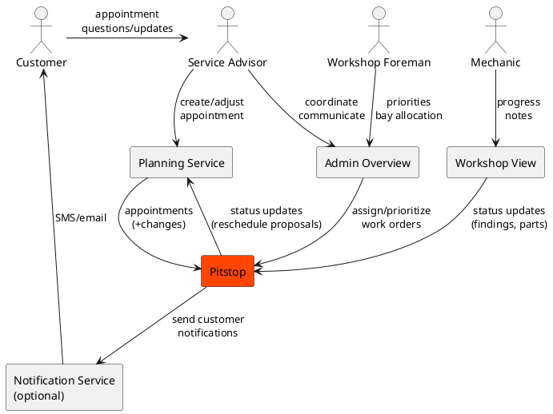
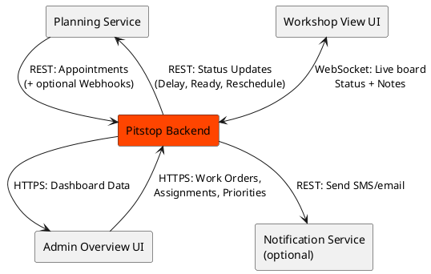
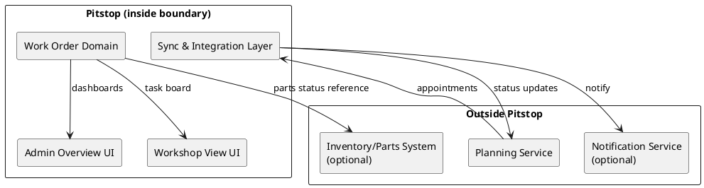

# 3. Context and Scope

Pitstop sits between:

- **Planning** (appointments and promises),
- **Admin** (coordination and customer communication),
- **Workshop execution** (reality: progress, delays, extra work),

and keeps them synchronized.

## 3.1 Business Context



| Actor / System | Responsibility | Exchanges with Pitstop |
|----------------|---------------|------------------------|
| Customer | Brings car, receives updates | ETA updates (via advisor/portal) |
| Service Advisor | Manages appointment and expectations | Priority changes, notes, customer communication |
| Workshop Foreman | Orchestrates execution | Assignments, reprioritization |
| Mechanic | Performs work | Status updates, findings, time spent |
| Planning Service | Owns schedule/time slots | Appointment import, reschedule suggestions |
| Notifications (optional) | Contact customers | SMS/email updates |

## 3.2 Technical Context



### Interfaces

| Peer | Interface | Direction | Protocol/Format | Notes |
|------|-----------|-----------|-----------------|-------|
| Planning Service | Appointments API | Inbound | REST/JSON | Full import + incremental sync |
| Planning Service (optional) | Webhooks | Inbound | HTTP/JSON | Push appointment changes |
| Pitstop to Planning | Status updates | Outbound | REST/JSON | Delay, ready, reschedule proposal |
| Admin Overview UI | Work Orders API | Bidirectional | HTTPS/JSON | RBAC, dashboards |
| Workshop View UI | Live Updates | Bidirectional | WebSocket/JSON | Low latency, optimized payloads |
| Notification Service | Notifications API | Outbound | REST/JSON | Customer updates |

### Example Payloads

**Appointment imported from planning:**

```json
{
  "appointmentId": "A-10293",
  "plate": "12-AB-34",
  "start": "2026-01-12T09:00:00+01:00",
  "service": "OilChange",
  "customerRef": "C-4451"
}
```

**Workshop update from a mechanic:**

```json
{
  "workOrderId": "WO-7781",
  "status": "WaitingForParts",
  "note": "Brake pads not in stock",
  "updatedBy": "mechanic-17",
  "updatedAt": "2026-01-12T10:41:00+01:00"
}
```

### Scope Boundary


