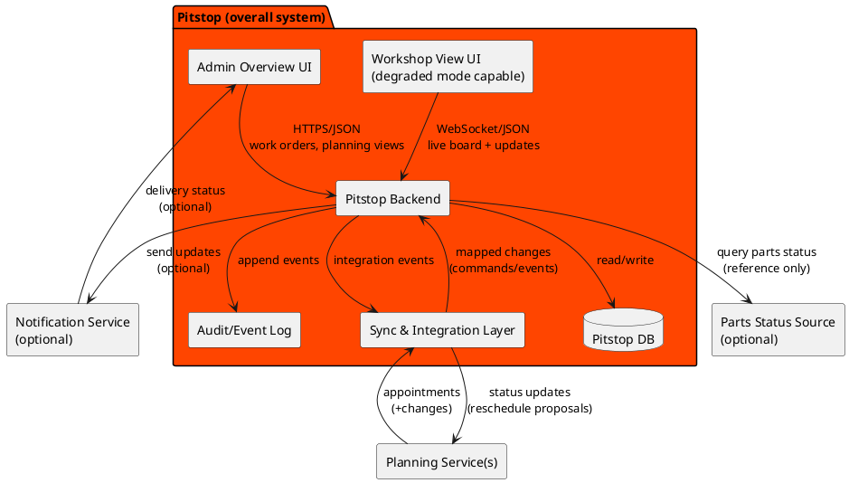
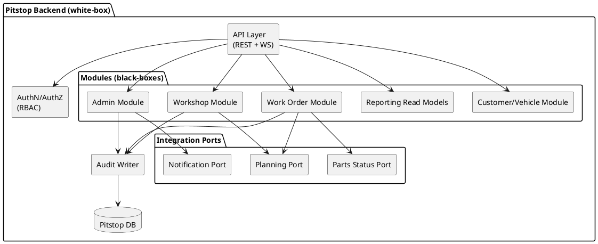

# 5. Building Block View

## 5.1 Level 1 — White-box Overall System

### Black-boxes (Level 1)

| Block | Responsibility | Key Interfaces |
|-------|---------------|----------------|
| Admin Overview UI | Dashboard, coordination, customer comms support | HTTPS/JSON to Backend |
| Workshop View UI | Bay/task board, fast updates, degraded mode | WebSocket/JSON to Backend |
| Backend | Core domain + APIs + orchestration | HTTPS/JSON + WS + internal module interfaces |
| Sync & Integration | Mapping + sync strategy per planning vendor | REST/JSON, webhooks, retry |
| Audit/Event Log | Immutable history for accountability + analytics | Append/read APIs |
| DB | Operational persistence | SQL (implementation-specific) |

## 5.2 Level 2 — Pitstop Backend

### Building blocks (Level 2)

| Element | Responsibility | Depends on |
|---------|---------------|------------|
| Work Order Module | Core logic for orders | Customer, Audit |
| Workshop Module | Mechanic task management | WorkOrders, Audit |
| Admin Module | Configuration and overrides | Audit |
| Customer/Vehicle Module | Shared entity data | Audit |
| Reporting | Read-optimized views | Domain Events |
| Planning Port | Adapter for Planning Service | External |
| Notification Port | Adapter for Notification Service | External |
| Parts Status Port | Adapter for parts/inventory query | External |
| Audit Writer | Centralized compliance logging | DB |
| API Layer | Protocol handling (HTTP/WS) | Auth, Modules |

**Notes:**

- Modules contain domain rules; ports isolate vendor protocols/mapping.
- Reporting read models can be optimized independently (avoid OLTP pain).
