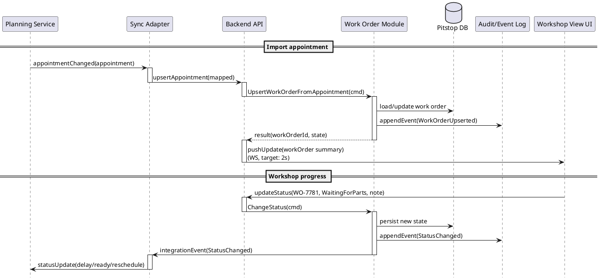
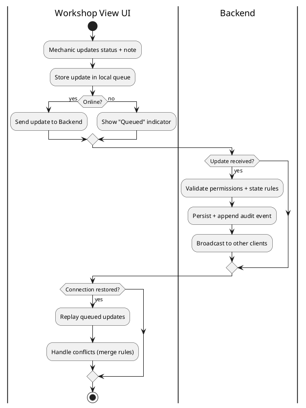

# 6. Runtime View

## 6.1 Scenario: Create/update order on appointment import

**Why this scenario matters:** It hits the core value — planning-to-execution sync. It exercises consistency, auditability, and integration boundaries.

**Failure / exception notes:**

- **Planning API unavailable**: Sync queues outbound updates with retry + backoff.
- **Duplicate appointment updates**: Idempotency key (appointmentId + version/timestamp).
- **Conflicting edits**: "Last-write-wins" only for safe fields; status changes may require foreman override.

## 6.2 Scenario: Degraded-mode workshop updates (offline then sync)

**Why this scenario matters:** Mechanic keeps working even if Wi-Fi is spotty. Updates are queued locally and reconciled when online. Exercises availability and conflict handling.

**Conflict handling rules:**

- **Notes**: append (safe merge).
- **Status changes**: validate allowed transitions; reject invalid transitions with a clear "needs foreman review" message.
