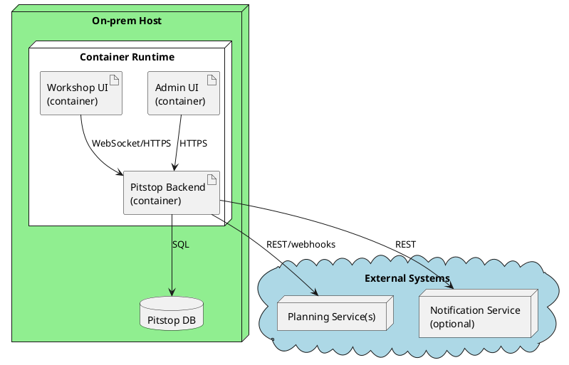

# 7. Deployment View

## Runtime Configuration

Pitstop behavior differs per garage/network reliability. These settings are owned by Ops.

**Key setting: `ConnectivityMode`**

- `OnlineFirst` (default): normal operation, real-time updates preferred
- `OfflineFirst`: prioritize local queueing + aggressive retries (workshop-heavy garages / flaky Wi-Fi)

```json
{
  "Pitstop": {
    "ConnectivityMode": "OfflineFirst",
    "Realtime": {
      "Transport": "WebSocket",
      "FallbackToPollingSeconds": 5
    },
    "Sync": {
      "RetryPolicy": "ExponentialBackoff",
      "MaxRetries": 10
    }
  }
}
```

## 7.1 Single Garage (containerized)



### Motivation

Small garages need a self-contained setup that works on a single machine without external dependencies.

### Mapping

| Building block | Runs on | Notes |
|---------------|---------|-------|
| Admin UI | Docker container | Served via reverse proxy |
| Workshop UI | Docker container | Served via reverse proxy |
| Pitstop Backend | Docker container | Main backend |
| Pitstop DB | Docker container | Persistent volume on host |

## 7.2 Multi-site (chain) — high-level variant

- Central DB + audit store; site-level caches for workshop responsiveness.
- Reporting can run off read replicas.

### Operational Notes

- **Monitoring**: request latency, WS connection health, sync queue depth, retry rate.
- **Backups**: DB daily + audit log retention policy.
- **Security**: network segmentation; outbound allowlist to planning/PSP endpoints.
