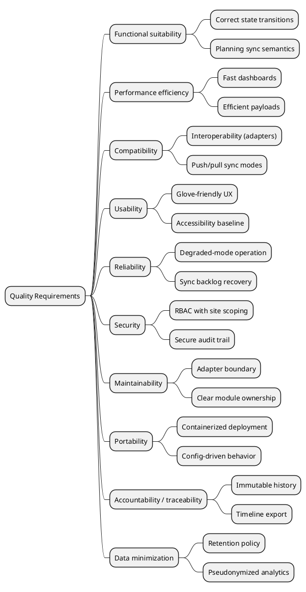

# 10. Quality Requirements

## 10.1 Quality Requirements Overview

## 10.2 Quality Scenarios

### Availability / Reliability

| Scenario | Stimulus | Response | Metric / Target |
|----------|----------|----------|----------------|
| Wi-Fi outage | 15 min disconnect | Workshop continues; updates queued | 99% actions succeed offline |
| Reconnect | Network returns | Queue replays + sync completes | Drained within 60s |
| Planning outage | Vendor down | Outbound updates queued + retried | Workshop not blocked |

### Modifiability / Maintainability

| Scenario | Stimulus | Response | Metric / Target |
|----------|----------|----------|----------------|
| Add new planning vendor | New API/mapping | Add adapter; domain unchanged | 2 days, core untouched |
| Add new status | `ReadyForPickup` | Update state machine + UI mapping | Localized change + tests |
| Change KPI definition | "Lateness" formula changes | Update read model only | No write-path impact |

### Consistency

| Scenario | Stimulus | Response | Metric / Target |
|----------|----------|----------|----------------|
| Status update visible | Mechanic sets `WaitingForParts` | Admin + Workshop UIs converge | 2s end-to-end (p95) |
| Duplicate planning updates | Same appointment sent twice | System processes once (idempotent) | 0 duplicate work orders |
| Conflict edit | Foreman reprioritizes while mechanic updates | Deterministic resolution + visible warning | Conflict surfaced, no silent loss |

### Auditability

| Scenario | Stimulus | Response | Metric / Target |
|----------|----------|----------|----------------|
| Customer dispute | "You promised 16:00" | Export full timeline | 60s export |
| Sensitive change | Discount/write-off | Stored with reason + actor | 100% completeness |
| Throughput analysis | Cycle time per bay | Derive from events | No manual stitching |

### Usability

| Scenario | Stimulus | Response | Metric / Target |
|----------|----------|----------|----------------|
| Glove-friendly update | Mechanic changes status | Minimal interactions | 3 taps, 5s |
| Foreman reprioritizes | Drag/drop | Visible everywhere | Reflected in 2s |

### Security

| Scenario | Stimulus | Response | Metric / Target |
|----------|----------|----------|----------------|
| Cross-garage access | User tries other `garageId` | Denied | 100% blocked |
| Token leaked | Reuse from unknown device | Revoke/expire quickly | Short TTL + refresh |
| Audit tampering | Try to edit history | Prevented + logged | Immutable storage |

### Observability

| Scenario | Stimulus | Response | Metric / Target |
|----------|----------|----------|----------------|
| Sync backlog grows | Vendor slow/down | Alert + diagnosis signal | `sync_queue_depth` alert |
| WS instability | Disconnect spike | Fallback works + alert | No data loss |
| Latency regression | New release | p95 tracked | Thresholds + release marker |
