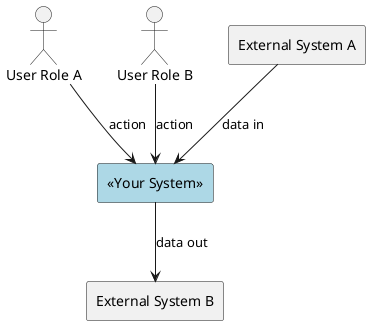
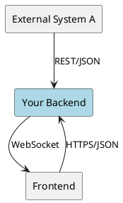

# 3. Context and Scope

> **Purpose**: Define what is *inside* vs *outside* your system. This is arguably the most important diagram in your documentation.

## 3.1 Business Context

> Show the system from a business perspective: who uses it and what they exchange.

| Actor / System | Responsibility | Exchanges with system |
|----------------|---------------|-----------------------|
| | | |

> **Tip**: The context diagram is a *communication* tool. Show it to stakeholders and ask: "Is anything missing? Is anything wrong?" If they can't understand it, simplify.

> **Tip**: Use PlantUML `skinparam shadowing false` and `skinparam componentStyle rectangle` for clean, readable diagrams.

## 3.2 Technical Context

> Show the same boundary but now with protocols, APIs, and data formats.

| Peer | Interface | Direction | Protocol/Format | Notes |
|------|-----------|-----------|-----------------|-------|
| | | | | |

> **Tip**: Include example payloads for key interfaces. A JSON example is worth a thousand words.

> **Anti-pattern**: Drawing internal components in the context diagram. Context = system as a black box. Internal structure goes in Chapter 5.

> **Anti-pattern**: Missing the scope boundary. If it's unclear what's inside vs outside, the diagram isn't doing its job.

## Completion Checklist

- [ ] System boundary is clearly visible (what's in, what's out)
- [ ] All external actors and systems are shown
- [ ] Business context is understandable by non-technical stakeholders
- [ ] Technical context shows protocols and data formats
- [ ] Key interfaces have example payloads
- [ ] No internal components leak into the context diagram
