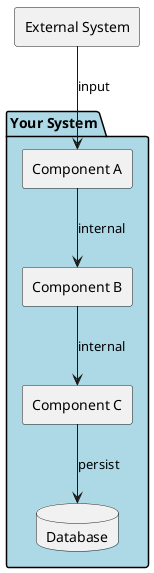
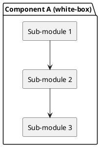

# 5. Building Block View

> **Purpose**: Show the static structure of your system — what are the major pieces and how do they relate? Start at Level 1 (big picture) and only add deeper levels where they provide value.

## 5.1 Level 1 — White-box Overall System

| Block | Responsibility | Key Interfaces |
|-------|---------------|----------------|
| | | |

> **Tip**: Use the `package` keyword in PlantUML to show system boundaries clearly.

> **Tip**: Each block should have a single clear responsibility. If you can't describe it in one sentence, it might need splitting.

> **Anti-pattern**: Showing every class or microservice at Level 1. Level 1 should have 5-10 blocks max.

## 5.2 Level 2 — Component Detail

<!-- Only decompose blocks that are complex or frequently discussed. -->

| Element | Responsibility | Depends on |
|---------|---------------|------------|
| | | |

> **Tip**: Only add Level 2/3 for blocks that are architecturally significant. Not every component needs decomposition.

> **Anti-pattern**: Creating a Level 3 "because the template has it". Only add depth where it prevents misunderstanding.

## Completion Checklist

- [ ] Level 1 shows the overall system with 5-10 major blocks
- [ ] Each block has a clear, single responsibility
- [ ] External dependencies are visible
- [ ] Level 2 only exists for components that need it
- [ ] Diagrams match the actual code structure
