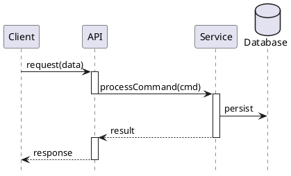
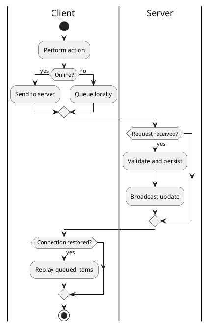

# 6. Runtime View

> **Purpose**: Show how the building blocks interact at runtime. Use sequence diagrams for request flows and activity diagrams for state-dependent behavior.

> **How to pick scenarios**: Choose 2-4 scenarios that:
> - Hit multiple building blocks from Chapter 5
> - Illustrate a quality goal from Chapter 1
> - Stakeholders frequently ask about
> - Include at least one failure/recovery scenario

## 6.1 Scenario: «Name — happy path»

**Why this scenario matters:** <!-- link to a quality goal or stakeholder concern -->

> **Tip**: Use `hide footbox` and `skinparam shadowing false` for cleaner sequence diagrams.

> **Tip**: Use `++` and `--` for activation/deactivation to show which component is "active" at each step.

**Failure / exception notes:**

- <!-- What happens when the database is unavailable? -->
- <!-- What happens with duplicate requests? -->

## 6.2 Scenario: «Name — error / edge case»

> **Tip**: Activity diagrams work well for offline/online scenarios, state machines, and branching logic.

> **Anti-pattern**: Only showing happy paths. Architecture is tested by failures, not successes. Always include at least one failure scenario.

> **Anti-pattern**: Sequence diagrams with 20+ participants. If your diagram is wider than a screen, you're showing too much. Split into sub-scenarios.

## Completion Checklist

- [ ] 2-4 key scenarios are documented
- [ ] At least one failure/recovery scenario is included
- [ ] Scenarios link to quality goals from Chapter 1
- [ ] Diagrams are readable without scrolling horizontally
- [ ] Failure notes explain what happens when things go wrong
