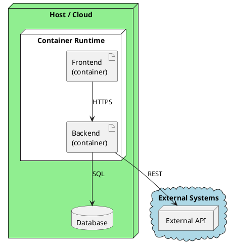

# 7. Deployment View

> **Purpose**: Show *where* the software runs. Map building blocks to infrastructure. Include runtime configuration that affects architecture behavior.

## 7.1 Primary Deployment



> **Tip**: Use PlantUML `node` for physical/virtual hosts, `artifact` for deployable units, `database` for storage, and `cloud` for external environments.

### Mapping

| Building block | Runs on | Notes |
|---------------|---------|-------|
| | | |

### Runtime Configuration

<!-- Document settings that change system behavior per environment. -->

```json
{
  "App": {
    "Setting": "value"
  }
}
```

> **Tip**: Configuration that changes architectural behavior (e.g., online-first vs offline-first mode) belongs here, not in a wiki.

> **Anti-pattern**: Showing only the "ideal" deployment. Document what you actually deploy, including any single-points-of-failure or known limitations.

> **Anti-pattern**: Ignoring network topology. If there's a firewall, VPN, or load balancer that affects behavior, show it.

## Completion Checklist

- [ ] All building blocks from Chapter 5 are mapped to infrastructure
- [ ] External systems and their network connections are shown
- [ ] Runtime configuration that affects behavior is documented
- [ ] The deployment matches what is actually running (not aspirational)
- [ ] Known limitations (no HA, single instance, etc.) are noted
