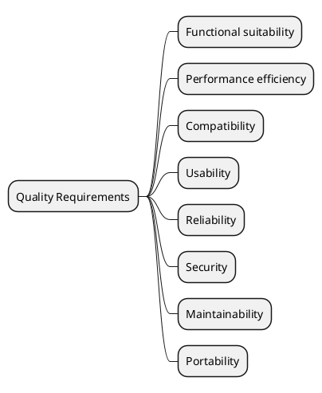

# 10. Quality Requirements

> **Purpose**: Make quality goals from Chapter 1 *testable*. Use scenario-based requirements that can serve as acceptance criteria.

## 10.1 Quality Requirements Overview

> **Tip**: Use the mind map to show which quality attributes matter. Expand only the ones relevant to your system.

## 10.2 Quality Scenarios

> **Format**: Each scenario follows the pattern: Given [context], when [stimulus], then [response] within [metric/target].

### Availability / Reliability

| Scenario | Stimulus | Response | Metric / Target |
|----------|----------|----------|----------------|
| | | | |

### Performance

| Scenario | Stimulus | Response | Metric / Target |
|----------|----------|----------|----------------|
| | | | |

### Security

| Scenario | Stimulus | Response | Metric / Target |
|----------|----------|----------|----------------|
| | | | |

### Maintainability

| Scenario | Stimulus | Response | Metric / Target |
|----------|----------|----------|----------------|
| | | | |

> **Tip**: Good quality scenarios are specific and testable. "The system should be fast" is not a scenario. "Dashboard loads in < 2s for 100 concurrent users" is.

> **Tip**: Link each scenario back to a quality goal from Chapter 1. If a scenario doesn't connect to a goal, question whether it's necessary.

> **Anti-pattern**: Copy-pasting generic quality scenarios from ISO 25010. Only include scenarios that are specific to YOUR system.

> **Anti-pattern**: Quality scenarios without metrics. "The system should be available" is not testable. "99.5% uptime measured monthly" is.

## Completion Checklist

- [ ] Every quality goal from Chapter 1 has at least one testable scenario
- [ ] Scenarios have specific, measurable targets
- [ ] At least one failure/recovery scenario exists
- [ ] Scenarios are specific to this system (not generic)
- [ ] Targets are realistic and agreed with stakeholders
