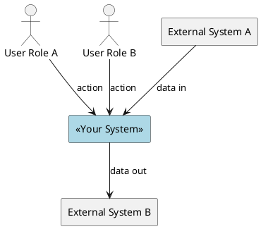
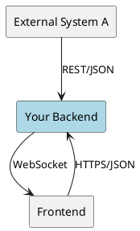

# 3. Context and Scope

<!-- What is inside vs outside the system boundary? -->

## 3.1 Business Context

<!-- Shows the system in its environment: who interacts with it and what they exchange. -->

| Actor / System | Responsibility | Exchanges with system |
|----------------|---------------|-----------------------|
| | | |

## 3.2 Technical Context

<!-- Shows technical interfaces: protocols, APIs, data formats. -->

| Peer | Interface | Direction | Protocol/Format | Notes |
|------|-----------|-----------|-----------------|-------|
| | | | | |
