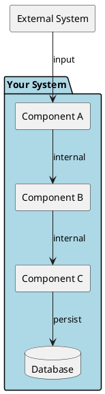
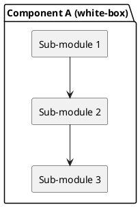

# 5. Building Block View

## 5.1 Level 1 — White-box Overall System

| Block | Responsibility | Key Interfaces |
|-------|---------------|----------------|
| | | |

## 5.2 Level 2 — Component Detail

<!-- Decompose the most important Level 1 blocks. Only add levels that provide value. -->

| Element | Responsibility | Depends on |
|---------|---------------|------------|
| | | |
