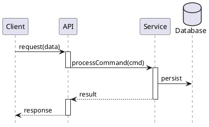
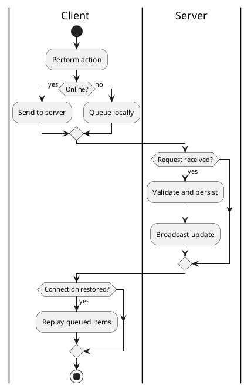

# 6. Runtime View

<!-- Show 2-4 key scenarios as sequence or activity diagrams. Pick scenarios that:
     - Hit multiple building blocks
     - Illustrate a quality goal (e.g., consistency, failure recovery)
     - Stakeholders ask about
-->

## 6.1 Scenario: «Happy path»

**Why this scenario matters:** <!-- link to a quality goal or stakeholder concern -->

**Failure / exception notes:**

- <!-- What happens when X fails? -->

## 6.2 Scenario: «Error / edge case»

