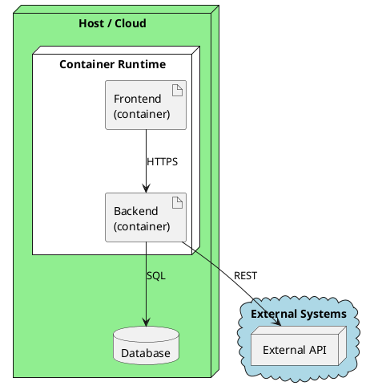

# 7. Deployment View

## 7.1 Primary Deployment



### Mapping

| Building block | Runs on | Notes |
|---------------|---------|-------|
| | | |

### Runtime Configuration

<!-- Document deployment-owned settings that affect behavior. -->

```json
{
  "App": {
    "Setting": "value"
  }
}
```
