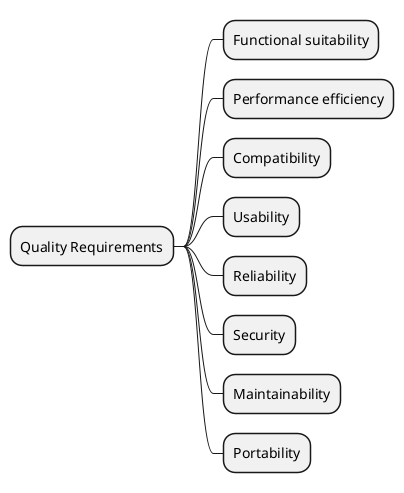

# 10. Quality Requirements

## 10.1 Quality Requirements Overview

## 10.2 Quality Scenarios

<!-- Testable scenarios. Use as acceptance criteria. -->

### Availability / Reliability

| Scenario | Stimulus | Response | Metric / Target |
|----------|----------|----------|----------------|
| | | | |

### Performance

| Scenario | Stimulus | Response | Metric / Target |
|----------|----------|----------|----------------|
| | | | |

### Security

| Scenario | Stimulus | Response | Metric / Target |
|----------|----------|----------|----------------|
| | | | |

### Maintainability

| Scenario | Stimulus | Response | Metric / Target |
|----------|----------|----------|----------------|
| | | | |
